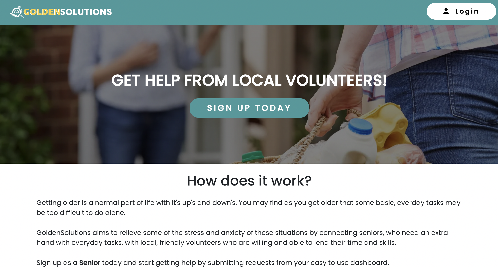
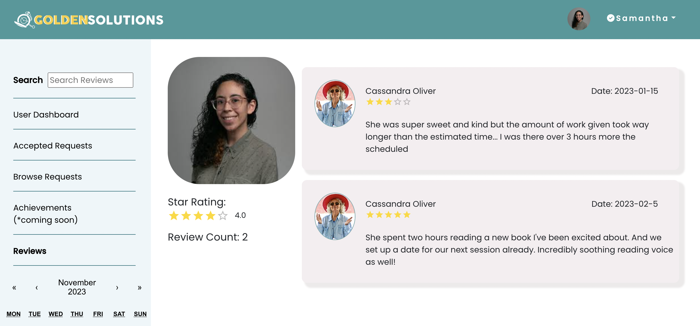

## Table of Contents

- [Overview](#overview)
- [Technologies](#technologies)
- [Features](#features)
    - User Auth
    - Request creation, update, deletion
    - Search Filter
    - Calendar Filter
    - Reviews & Ratings
- [Local Setup](#local-setup)
- [Screen Shots](#screen-shots)

## OVERVIEW

GoldenSolutions is an application that allows senior users to connect with volunteer users. Users with a senior account can upload requests they need help with and users with a volunteer account can accept or decline those requests. 

[Click here to visit GoldenSolutions!](https://goldensolutions.netlify.app/)


## TECHNOLOGIES

- Javascript
- React
- PostgreSQL DB
- Express
- CSS & React Bootstrap
- Firebase
- Node
- Material UI

## FEATURES

**User Auth**
- Users can sign up and create a new account via multiple pages on the app while still being able to enjoy other functionality while not logged in.
- Users who have not created an account and attempt to sign in with Google will be redirected to sign up.

**Request Index**
- There are two user dashboard views, one for a senior account and one for a volunteer user account. 
- Users can view requests they've submitted, accepted or that are pending. 
- Requests are organized on the User Dashboard page according to the date.

**Request Creation**
- Users can create, store, and manage requests from their dashboard.
- Users can submit for their request a title, time, date, description, location, and image that will persist to the form.

**Search Filter**
- Via the dashboard, a user can filter through the requests based on search input. 

**Calendar Filter**
- A user can filter through the requests by selecting a date on the calendar. 

**Reviews & Ratings**
- Users can leave each other a review and rating upon completion of request.

## Local Setup

### Frontend Setup

```bash
# clone the repository to your local machine

git clone https://github.com/samfigueroa92/capstone-project.git

# navigate to the front-end directory

cd front-end

# create a .env file and add your back-end api url to allow the front-end to access the back-end locally

npm install dotenv
touch .env

# install the required node modules

npm install

# start the server

npm start
```

### Backend Setup

```bash
# navigate to the back-end directory
cd back-end

# install the required node modules
npm install

# start the server
npm start
```

## SCREEN SHOTS

**Home Page**


A user can signup from this page or login with their account credentials. They can also navigate to additional pages with more information.

**Login Modal**


A user can choose to signin with their Google account. They will be redirected to signup first if they do not have an account in the database.

**Request Index**


Once logged in, a user will be redirected to their userdashboard that shows a list of requests.

**Request Show**


A user can click on a request to get more details about it, accept/reject it.

**Reviews**


A user can view leave another user a review & rating upon completion of a request. Users can also see each others reviews and ratings from the Reviews Page. 
