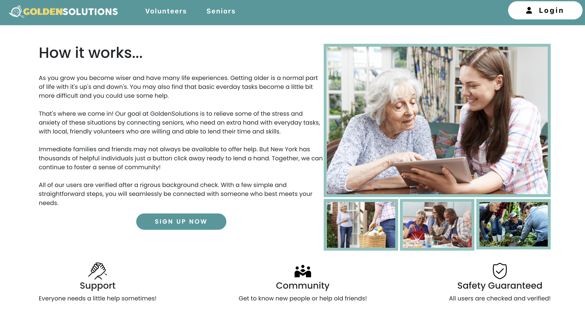
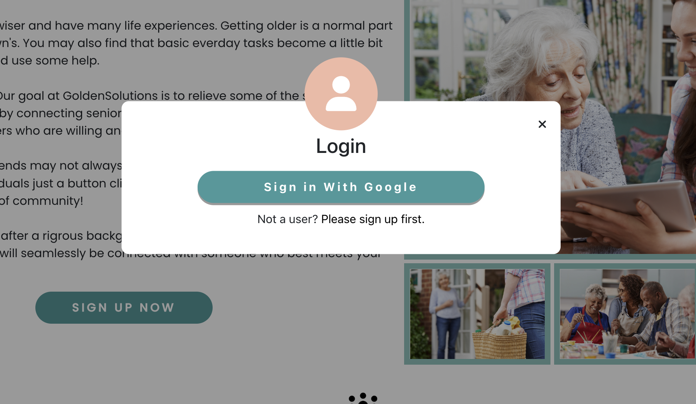
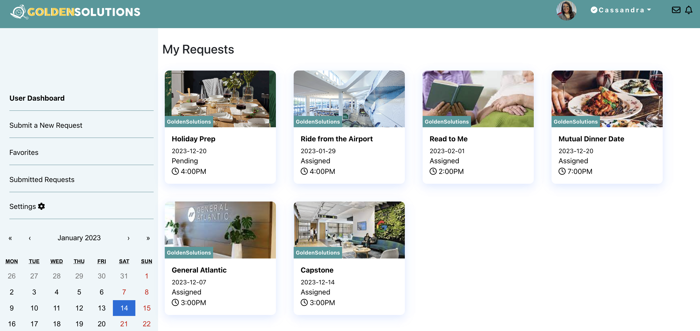
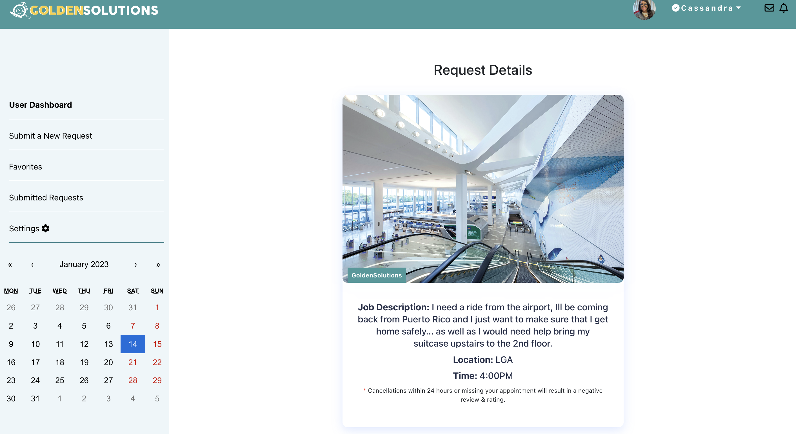

## Table of Contents

- [Overview](#overview)
- [Technologies](#technologies)
- [ScreenShots](#screnshots)
- [Features](#features)
    - User Auth
    - CRUD

## OVERVIEW

GoldenSolutions is an application that allows senior users to connect with volunteer users. Users with a senior account can upload requests they need help with and users with a volunteer account can accept or decline those requests. 

- [Visit GoldenSolutions](https://goldensolutions.netlify.app/)

## TECHNOLOGIES

- Javascript
- React
- PostgreSQL DB
- Express
- CSS & React Bootstrap
- Firebase

## SCREENSHOTS

**Home Page**

A user can signup from this page or login with their account credentials. They can also navigate to additional pages with more information.

**Login Modal**

A user can choose to signin with their Google account. They will be redirected to signup first if they do not have an account in the database.

**Request Index**

Once logged in, a user will be redirected to their userdashboard that shows a list of requests.

**Request Show**

A user can click on a request to get more details about it, accept/reject it.

## FEATURES

**User Auth**

- Users can sign up and create a new account via multiple pages on the app while still being able to enjoy other functionality while not logged in.
- Users who have not created an account and attempt to sign in with Google will be redirected to sign up.

**Request Index**

- There are two user dashboard views, one for a senior account and one for a volunteer user account. 
- Users can view requests they've submitted, accepted or that are pending and sort by date using the calendar. 
- Requests are orgaized on the User Dashboard page according to the date

**Request Creation**

- Users can create, store, and manage requests through from their dashboard.
- Users can submit for their request a title, time, date, description, location, and image that will persist to the form.

**Calendar Filter**
- A user can filter through the requests by selecting a date on the calendar. 